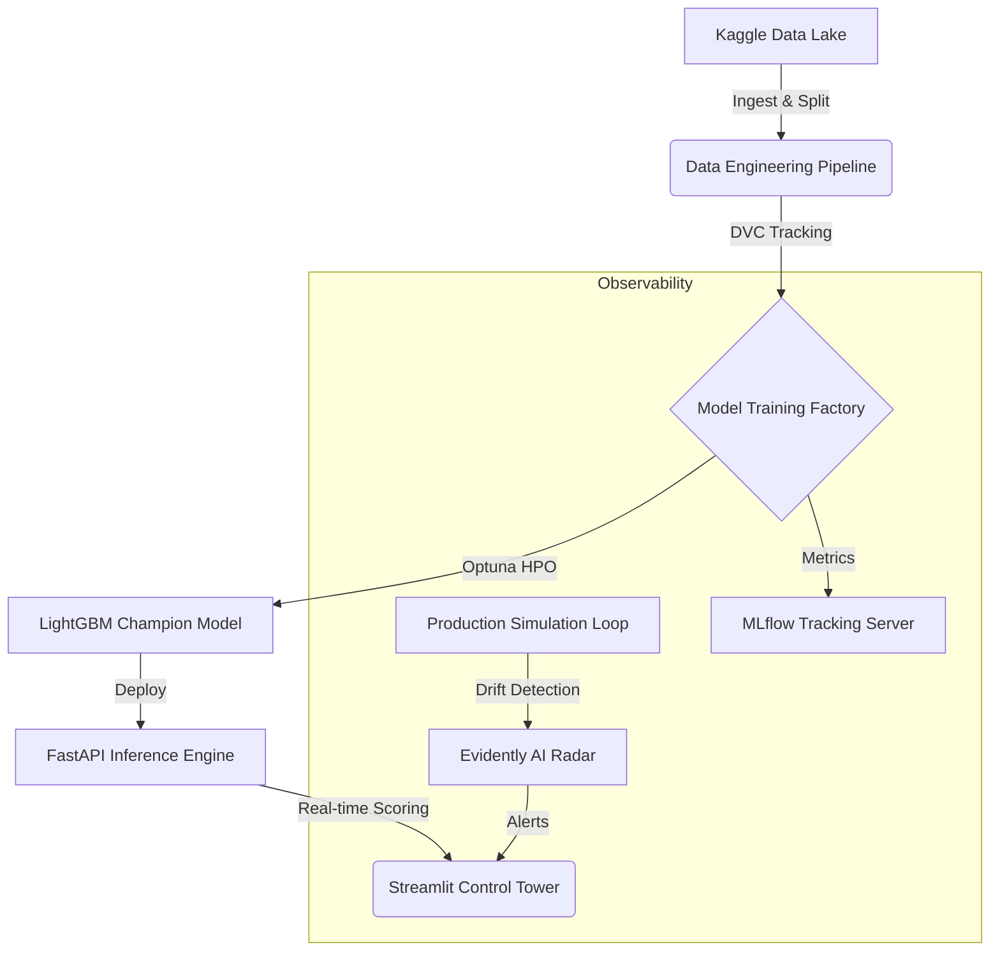

# 🏦 Risk Scoring Engine: Production-Grade MLOps System

   

> **"Un sistema robusto no es el que tiene el mejor modelo, sino el que sobrevive en producción."**

Este repositorio contiene una arquitectura **End-to-End** de MLOps para la evaluación de riesgo crediticio. Diseñado para simular un entorno bancario real, integra desde la ingesta de datos crudos hasta un Dashboard de Monitoreo en tiempo real con detección de Data Drift.

---

## 🏗️ Technical Architecture

El sistema no son solo scripts sueltos; es un ecosistema de microservicios.



### 1. 🧠 Motor de Inteligencia (Core ML)

* **Champion Model**: LightGBM optimizado con **Optuna** (MedianPruner).
* **Feature Engineering**: Pipeline persistente (`.pkl`) que asegura cero *Training-Serving Skew*. Transforma datos crudos, imputa nulos y aplica *One-Hot Encoding* automáticamente.
* **Performance**: AUC ROC de **0.769** (Top ~40% competitivo), optimizado para baja latencia (<50ms).

### 2. 🛡️ Búnker de Monitoreo (Observability)

* **Emergency Stop**: Sistema automatizado que bloquea inferencias si el **Data Drift** supera el umbral del 1%.
* **Simulación de "Cisne Negro"**: Scripts dedicados para estresar el sistema inyectando datos corruptos y validando la respuesta de las alertas.
* **Evidently AI + MLflow**: Generación de reportes HTML profundos sobre la salud estadística de los datos.

### 3. 🚀 Capa de Servicio (Production API)

* **FastAPI**: Inferencia asíncrona de alto rendimiento.
* **Robustez**: Auto-complete inteligente de features faltantes (maneja JSONs incompletos sin romper el servicio).
* **Endpoints**:
  * `POST /predict`: Scoring en tiempo real.
  * `GET /drift-status`: Semáforo de salud del sistema.

### 4. 🗼 Torre de Control (Dashboard)

* **Streamlit Premium UI**: Interfaz visual para stakeholders.
* **Simulador Interactivo**: Permite a analistas de riesgo probar escenarios hipotéticos.
* **Métricas en Vivo**: Tasa de aprobación, volumen de solicitudes y alertas de drift.

---

## ⚡ Quick Start

### 1. Setup del Entorno

```bash
python -m venv venv
source venv/bin/activate
pip install -r requirements.txt
```

### 2. Ejecutar la Simulación Completa

Este comando orquesta todo: descarga datos, entrena el modelo y simula tráfico de producción.

```bash
dvc repro
```

### 3. Lanzar el Sistema (Dual Terminal)

**Terminal 1: El Cerebro (API)**

```bash
venv/bin/python src/api/app.py
# Running on http://localhost:8000
```

**Terminal 2: La Cara (Dashboard)**

```bash
venv/bin/streamlit run src/ui/dashboard.py
# Running on http://localhost:8501
```

---

## � Estrategia de Validación

* **Offline Evaluation**: Cross-validation estratificado para asegurar estabilidad en clases desbalanceadas (Default vs Pay).
* **Online Monitoring**: El sistema calcula diariamente la distancia estadística (**Jensen-Shannon** y **Kolmogorov-Smirnov**) entre los datos de entrenamiento y los de producción.

## 🔜 Roadmap: La Era de los Agentes

El siguiente paso natural de esta arquitectura es la integración de **Agentes Autónomos (LLMs)**.
* [ ] Implementar un Agente ReAct que consulte la API de riesgo y fuentes externas (Google Search) para enriquecer la decisión de crédito.
* [ ] Generación automática de explicaciones de rechazo (XAI) usando GPT-4.

---

### Autor

**[Tu Nombre]** - *AI Engineer & MLOps Architect*
