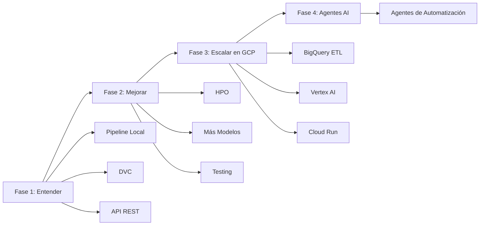

# 📚 Guía de Estudio: Risk Scoring Engine
## De Data Scientist (Notebooks) a ML Engineer

> **Objetivo:** Entender profundamente cómo se construye un sistema de ML end-to-end en producción, desde ETL hasta deployment.

---

## 🗺️ Roadmap de Aprendizaje



---

## 📖 FASE 1: ENTENDER EL SISTEMA ACTUAL

### 🔍 Día 1-2: La Arquitectura General

#### **¿Qué diferencia este proyecto de un Notebook?**

| Aspecto | Notebook Tradicional | Este Proyecto (MLOps) |
|---------|---------------------|----------------------|
| **Código** | Todo en un solo archivo .ipynb | Modular (src/data, src/features, src/models) |
| **Reproducibilidad** | Manual, dependiente del orden de celdas | Automatizada con DVC pipelines |
| **Datos** | Cargados en memoria cada vez | Versionados y cacheados por DVC |
| **Modelo** | Se entrena cada vez | Solo se reentrena si cambian datos/código |
| **Deployment** | No hay | API REST lista para producción |
| **Colaboración** | Difícil (conflictos en .ipynb) | Código Python estándar + Git |

#### **Ejercicio 1: Mapea el Flujo de Datos**

Abre estos archivos y responde:

1. **`dvc.yaml`** (líneas 1-28)
   - ¿Cuántas etapas tiene el pipeline?
   - ¿Qué archivos de entrada necesita cada etapa?
   - ¿Qué salidas produce cada etapa?

2. **Diagrama Mental:**
   ```
   data/01_raw/*.csv 
         ↓ (process_data)
   data/03_primary/credit_data_processed.csv
         ↓ (engineer_features)
   data/04_features/*.npy + feature_pipeline.pkl
         ↓ (train_model)
   models/credit_risk_model_*.pkl
   ```

**🎯 Checkpoint:** Puedes explicar qué archivo genera cada etapa y por qué.

---

### 🔧 Día 3-4: Profundizando en el Pipeline de Datos

#### **Archivo Clave: `src/data/make_dataset.py`**

Este es tu primer ejemplo de **Data Engineering en Python puro**.

##### **Conceptos a Entender:**

1. **Modularidad (líneas 23-50):**
   ```python
   def create_dummy_data() -> tuple:
       """Una función, una responsabilidad"""
   ```
   - ❓ ¿Por qué separar en funciones en lugar de un script lineal?
   - 💡 **Respuesta:** Testeable, reutilizable, debuggeable

2. **Logging Profesional (líneas 16-20):**
   ```python
   logging.basicConfig(level=logging.INFO)
   logger.info("Cargando datos...")
   ```
   - ❓ ¿Por qué no usar `print()`?
   - 💡 **Respuesta:** Los logs tienen timestamps, niveles (INFO/ERROR), se pueden redirigir a archivos/cloud

3. **Agregaciones SQL-like en Pandas (líneas 68-74):**
   ```python
   bureau_agg = df_bureau.groupby('SK_ID_CURR').agg({
       'DAYS_CREDIT': ['mean', 'max', 'min'],
   })
   ```
   - ❓ ¿Qué hace esto en términos de SQL?
   - 💡 **Respuesta:** `SELECT SK_ID_CURR, AVG(DAYS_CREDIT), MAX(DAYS_CREDIT) ... GROUP BY SK_ID_CURR`

##### **Ejercicio 2: Debugging Práctico**

```bash
# Ejecuta solo esta etapa del pipeline
dvc repro process_data

# Mira los logs
cat .dvc/tmp/process_data.log

# Inspecciona el output
head -20 data/03_primary/credit_data_processed.csv
```

**🎯 Checkpoint:** Entiendes cómo se unen múltiples tablas (application_train + bureau) y por qué esto es parecido a ETL.

---

### ⚙️ Día 5-6: Feature Engineering

#### **Archivo Clave: `src/features/build_features.py`**

Este archivo es **crítico** para ML en producción.

##### **Conceptos a Entender:**

1. **Pipelines de Sklearn (líneas 62-92):**
   ```python
   numeric_transformer = Pipeline([
       ('imputer', SimpleImputer(strategy='median')),
       ('scaler', StandardScaler())
   ])
   ```
   - ❓ ¿Por qué no hacer `df['col'] = (df['col'] - mean) / std`?
   - 💡 **Respuesta:** El pipeline se entrena en train y se aplica a test/producción **con los mismos parámetros**

2. **fit_transform vs transform:**
   ```python
   # En entrenamiento:
   X_transformed = pipeline.fit_transform(X_train)
   
   # En producción (API):
   X_transformed = pipeline.transform(X_new)
   ```
   - ❓ ¿Por qué guardamos `feature_pipeline.pkl`?
   - 💡 **Respuesta:** Para aplicar **exactamente las mismas transformaciones** a datos nuevos

3. **Feature Engineering (líneas 48-60):**
   ```python
   df['CREDIT_INCOME_PERCENT'] = df['AMT_CREDIT'] / df['AMT_INCOME_TOTAL']
   ```
   - ❓ ¿Por qué crear estas features derivadas?
   - 💡 **Respuesta:** Ratios financieros son más informativos que valores absolutos para riesgo crediticio

##### **Ejercicio 3: Experimentos con Features**

Modifica `build_features.py` para agregar una nueva feature:

```python
# Línea 54 (después de CREDIT_INCOME_PERCENT)
df['AGE_YEARS'] = -df['DAYS_BIRTH'] / 365
df['EMPLOYMENT_YEARS'] = -df['DAYS_EMPLOYED'] / 365
```

Ejecuta:
```bash
dvc repro engineer_features
# DVC detecta el cambio y re-ejecuta desde aquí
```

**🎯 Checkpoint:** Entiendes la diferencia entre transformar datos en un notebook (temporal) vs. crear un pipeline reutilizable.

---

### 🤖 Día 7-8: Entrenamiento del Modelo

#### **Archivo Clave: `src/models/train_model.py`**

##### **Conceptos a Entender:**

1. **Clases para Organizar Código (líneas 27-96):**
   ```python
   class CreditRiskModel:
       def load_data(self):
       def train(self):
       def validate(self):
   ```
   - ❓ ¿Por qué una clase en lugar de funciones sueltas?
   - 💡 **Respuesta:** El modelo mantiene estado (self.model, self.X_train), es más fácil extender

2. **Validación Cruzada (líneas 72-78):**
   ```python
   cv_scores = cross_val_score(model, X, y, cv=5, scoring='roc_auc')
   ```
   - ❓ ¿Por qué no solo train_test_split?
   - 💡 **Respuesta:** CV es más robusto, usa múltiples splits para evaluar

3. **Serialización de Modelos (líneas 87-95):**
   ```python
   joblib.dump(self.model, "model.pkl")
   ```
   - ❓ ¿Por qué .pkl en lugar de guardar código?
   - 💡 **Respuesta:** El modelo incluye pesos entrenados, no solo arquitectura

##### **Ejercicio 4: Cambiar el Tipo de Modelo**

Edita `params.yaml`:
```yaml
models:
  model_type: random_forest  # Cambia de logistic_regression
```

Ejecuta:
```bash
dvc repro train_model
```

Compara los AUC scores. ¿Cuál es mejor?

**🎯 Checkpoint:** Entiendes cómo parametrizar experimentos sin cambiar código.

---

### 🌐 Día 9-10: API REST para Inferencia

#### **Archivo Clave: `src/api/main.py`**

Este es el **puente entre ML y software engineering**.

##### **Conceptos a Entender:**

1. **FastAPI Basics (líneas 17-21):**
   ```python
   app = FastAPI(title="Credit Risk Scoring API")
   
   @app.post("/score")
   async def predict_score(data: ClientData):
   ```
   - ❓ ¿Por qué async?
   - 💡 **Respuesta:** Permite manejar múltiples requests concurrentes

2. **Pydantic Models (líneas 24-37):**
   ```python
   class ClientData(BaseModel):
       AMT_INCOME_TOTAL: float
       AMT_CREDIT: float
   ```
   - ❓ ¿Por qué definir un esquema?
   - 💡 **Respuesta:** Validación automática, documentación generada, type safety

3. **Carga de Modelos en Startup (líneas 46-62):**
   ```python
   @app.on_event("startup")
   async def startup_event():
       model = joblib.load("model.pkl")
   ```
   - ❓ ¿Por qué cargar en startup y no en cada request?
   - 💡 **Respuesta:** Cargar el modelo es lento (segundos), solo se hace una vez

##### **Ejercicio 5: Prueba la API Localmente**

```bash
# Terminal 1: Levanta la API
uvicorn src.api.main:app --reload

# Terminal 2: Haz un request
curl -X POST http://localhost:8000/score \
  -H "Content-Type: application/json" \
  -d '{
    "AMT_INCOME_TOTAL": 150000,
    "AMT_CREDIT": 300000,
    "AMT_ANNUITY": 15000,
    "DAYS_BIRTH": -12000,
    "DAYS_EMPLOYED": -2000
  }'
```

Ve a http://localhost:8000/docs para la documentación interactiva.

**🎯 Checkpoint:** Entiendes cómo un modelo .pkl se convierte en un servicio HTTP.

---

### 🔄 Día 11-12: DVC - El Núcleo de MLOps

#### **¿Por qué DVC?**

| Sin DVC | Con DVC |
|---------|---------|
| `python script1.py && python script2.py && ...` | `dvc repro` |
| Re-ejecuta todo siempre | Solo re-ejecuta lo que cambió |
| Datos no versionados | Datos en .dvc tracked by git |
| No hay caché | Caché inteligente de outputs |

##### **Conceptos a Entender:**

1. **Dependencias (deps) y Salidas (outs):**
   ```yaml
   stages:
     process_data:
       cmd: python src/data/make_dataset.py
       deps:
         - src/data/make_dataset.py  # Si cambia el código
         - data/01_raw               # O si cambian los datos
       outs:
         - data/03_primary           # DVC cachea esto
   ```

2. **dvc.lock (estado del pipeline):**
   ```yaml
   process_data:
     cmd: python ...
     deps:
     - md5: a1b2c3d4  # Hash del código
     outs:
     - md5: e5f6g7h8  # Hash de los datos generados
   ```
   - DVC compara estos hashes para saber si necesita re-ejecutar

##### **Ejercicio 6: Experimenta con el Caché**

```bash
# Ejecuta el pipeline
dvc repro

# Borra los outputs
rm -rf data/03_primary data/04_features models/*.pkl

# Recupera desde el caché (sin re-ejecutar)
dvc checkout

# Verifica que los archivos están de vuelta
ls -lh models/
```

**🎯 Checkpoint:** Entiendes que DVC es como Git pero para datos/modelos grandes.

---

## 📊 RESUMEN DE FASE 1

### Conceptos Clave Aprendidos:

✅ **ETL en Python:** Agregaciones, joins, transformaciones modulares  
✅ **Feature Pipelines:** fit/transform, serialización, reproducibilidad  
✅ **Entrenamiento Parametrizado:** YAML configs, validación cruzada  
✅ **API REST:** FastAPI, Pydantic, model serving  
✅ **Orquestación:** DVC para pipelines reproducibles  

### Diferencias con Notebook:

| Notebook | Proyecto MLOps |
|----------|----------------|
| Exploración | Producción |
| Manual | Automatizado |
| Código lineal | Modular |
| No reproducible | Reproducible |
| Solo local | Deploy-ready |

---

## 🚀 PRÓXIMOS PASOS

Una vez completes esta fase, estarás listo para:

### **Fase 2: Mejoras Locales (1-2 semanas)**
- Hyperparameter Optimization (Optuna)
- Más modelos (XGBoost, LightGBM)
- Métricas avanzadas (Gini, KS-Statistic)
- Testing (pytest)

### **Fase 3: Escalar a GCP (2-3 semanas)**
- BigQuery para ETL de datos grandes
- Vertex AI Pipelines (DVC → Vertex)
- Cloud Run para deployment
- Vertex AI Model Registry

### **Fase 4: Agentes de Automatización (Avanzado)**
- Agentes que escriben código de feature engineering
- Agentes que optimizan hiperparámetros
- Agentes que monitorean drift y reentrenan

---

## 📝 Ejercicio Final de Fase 1

**Proyecto Mini:** Crea una versión simplificada del pipeline para otro dataset (ej. Titanic de Kaggle):

1. Crea `src/data/make_titanic.py`
2. Define un pipeline de DVC
3. Entrena un modelo
4. Crea una API que predice supervivencia
5. Todo versionado con DVC

Tiempo estimado: 4-6 horas

**¿Listo para empezar?** Comienza con el Día 1-2 y ve completando los ejercicios. Cada checkpoint es crucial antes de avanzar.

---

## 🤔 Preguntas para Reflexionar

Después de esta fase, deberías poder responder:

1. ¿Por qué `dvc repro` es mejor que `bash run_all.sh`?
2. ¿Por qué guardamos `feature_pipeline.pkl` además del modelo?
3. ¿Qué pasa si cambio una feature en producción sin reentrenar?
4. ¿Cómo se vería esto con millones de filas? (respuesta: BigQuery)
5. ¿Cómo automatizar el reentrenamiento? (respuesta: CI/CD + Vertex AI)

Si puedes responder estas 5, estás listo para Fase 2 y GCP.
